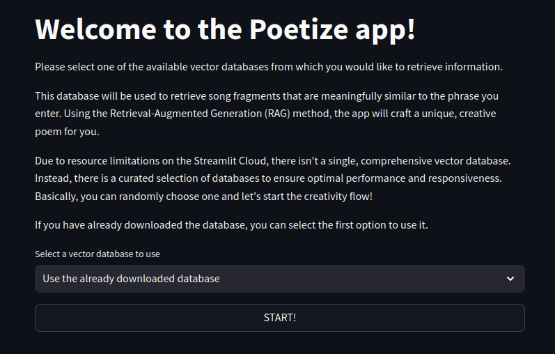

# Poetize

Deployed project can be found at [Poetize](https://poetize.streamlit.app)

This project utilizes Retrieval-Augmented Generation (RAG) to generate creative poems based on song lyrics.
When the user inputs a short or long phrase, the system queries a Chroma DB vector database to retrieve relevant song fragments.
These fragments, taken from a variety of song lyrics, are then used by ChatGPT to create a unique poem.

The process works as follows:

- The user enters a phrase or theme.
- The system uses RAG to query the Chroma DB vector database and retrieve the most relevant song lyric fragments.
- ChatGPT then takes these song fragments and generates a poem that reflects the user’s input, blending creativity with song lyrics.

This project combines the power of RAG and AI to creatively transform song lyrics into personalized poetry, offering an engaging and fun experience for the user.

## Table of Contents

1. [Lyrics Processing](#lyrics-processing)
2. [Poem Generation](#poem-generation)
3. [Project Structure](#project-structure)
4. [Installation and Setup](#installation-and-setup)

## Lyrics Processing

### Overview:

Firstly, I downloaded the lyrics and saved them in an organized folder structure `lyrics_processing/lyrics/{ARTIST}/{SONG}.txt` with lyrics inside the text file.
Next, I sanitized the files by removing duplicates and lyrics containing non-ASCII characters.
After that, I split the documents into smaller chunks, followed by eliminating any duplicate chunks that came from the same source.

Once the documents were split and duplicates were removed, I calculated the number of tokens required for embedding the text and estimate the cost. I then performed the embedding using OpenAI's **text-embedding-3-small** model and stored the embeddings in Chroma DB.
This process created one large vector database. However, due to limitations related to Streamlit Cloud, I had to split the large database into five smaller ones.
With these smaller databases in place, I was able to proceed with processing the data using the project’s user interface.

### Downloading Lyrics

This project utilizes the **lyricsgenius** Python library to download song lyrics from Genius.com.
I gathered several datasets for popular songs, albums, and artists, and stored them in the `lyrics_processing/datasets` directory.

1. Popular Albums Dataset: `popular_albums_dataset.csv` with 501 records
2. Popular Songs Dataset: `popular_songs_dataset.csv` with 5,282 records
3. Popular Artists Dataset: `popular_artists_dataset.csv` with 8,338 records

I used these datasets to download the lyrics by running the code located in `lyrics_processing/download_lyrics.py`.

The lyrics are fetched for songs based on three primary criteria:

1. Popular Albums: All available songs from each popular album are fetched.
2. Popular Songs: Lyrics are downloaded for individual popular songs if they are found.
3. Popular Artists: For each popular artist, up to 50 of their top songs are retrieved.

The API key used to access Genius' lyrics service was obtained from the official Genius API documentation, available at: [Genius API Documentation](https://docs.genius.com).

### Processing Lyrics

With the lyrics downloaded to a properly organized folder structure, I loaded all of them into the system and used the source (document path) metadata to create the artist and title metadata.
This was achieved using the script located in `lyrics_processing/vectorize_lyrics.ipynb`.

#### Data Preprocessing Steps

1. Removing Duplicates - I removed duplicate entries from the lyrics folder based on the _page_content_ column, keeping only the first instance for each combination of title and artist, prioritizing the shortest version.
2. Filtering Non-English Documents - All non-English documents containing non-ASCII characters in the _page_content_ column were deleted from the lyrics folder.
3. Splitting Documents - The lyrics were split into smaller text chunks with the following criteria:
   - Maximum size of 300 characters.
   - 150-character overlap between consecutive chunks.
   - Splitting was done using the separators _\n\n_ (paragraphs) and _\n_ (lines). So, the lyrics were split by paragraphs, and then each paragraph was further split by lines.
4. Removing Duplicate Chunks - Duplicate chunks were identified and removed based on the source and _page_content_ columns. After this part, I got **629180** split documents.
5. Token Estimation - The total number of tokens was calculated to estimate the cost of embedding and to select a model that fits within the budget. The number of tokens in my case was **44213256**.
6. Embedding Documents - The cleaned and split documents were embedded using OpenAI’s **text-embedding-3-small**. The resulting embeddings were stored in a Chroma DB vector database.

#### Database Optimization and Storage

After creating the initial large vector database, I loaded the documents using `lyrics_processing/load_the_vectorized_lyrics.ipynb` to ensure everything was processed correctly.
Due to memory limitations on the Streamlit Community Cloud, I split the large database into five smaller databases to reduce resource usage.
These smaller databases were uploaded to Google Drive, and the application allows users to select and download a specific database via a provided link.

#### Handling Version Update Warnings

During the project development, new package versions were released, and I began receiving the following warning:
'After upgrading to Chroma version 0.5.6 or later, it's advisable to run the chroma utils vacuum command to optimize your database.'

In response, I ran the command `chroma utils vacuum --path chroma_db`

This reduced the size of the Chroma DB by almost 50%. While the database is still too large to use as a single entity, the optimization significantly improved the speed of downloading and extracting smaller subsets.

## Poem Generation

### OpenAI API Key Configuration

At the beginning, the user must provide a valid OpenAI API key to configure the application:


### Vector Database Configuration

Once a valid key is submitted, the user is directed to the next page to configure the vector database.



The user can choose from the following options:

1. Use the already downloaded database: Select this option if one of the databases has already been downloaded and you do not wish to switch to another one.
2. Download and use a specific database part: Choose this option to select and download a specific part of the database to use.


After selecting the desired option, the user must click the **START!** button to proceed.
Behavior Based on Selection

1. If the Use the already downloaded database option is selected:
   - The app checks if the chosen database already exists locally.
   - If the database exists, the user is taken to the main view.
   - If the database does not exist, a warning is displayed, and the user must select another option.
2. If a specific database part is selected for download:
   - The app downloads and extracts the database.
   - Once the process is complete, the user is taken to the main view.


### Poetize Main View

#### User Input

In the Poetize main view, the user provides a phrase that will be used to query the vector database and retrieve several documents with the highest similarity to the input.
User Configuration Options:

1. Temperature

   The user sets the temperature using a slider.
   Temperature controls the randomness of the generated text:

- Lower values result in more predictable and structured output.
- Higher values produce more creative and varied text.
  The default value is 0.5.

2. Poem Language

   The user specifies the desired language for the poem.
   By default, the language is set to English.
   The user can change it by typing the desired language, such as "English," "Polish," "Italian," etc.

Once these settings are configured, the user clicks the **Submit** button to start the poem generation process.


#### Generated Output

Below the **Submit** button, there is an expander that allows the user to view the matched lyrics fragments. This includes details such as:

- The artist
- The title
- The fragment itself


After the matching fragments are displayed, the generated poem is shown below.


## Project Structure

```
poetize/
├── chroma_db (if downloaded)               # A directory where the Chroma vector database is stored when downloaded.
├── lyrics_processing                       # Contains all the scripts and data related to downloading, processing, and vectorizing lyrics.
│   ├── datasets                            # Contains the datasets with albums, artists and songs names.
│   ├── download_lyrics_functions.py        # Functions for downloading lyrics.
│   ├── download_lyrics.py                  # A script that handles the downloading of the lyrics data.
│   ├── load_the_vectorized_lyrics.ipynb    # A Jupyter notebook for loading, examining and splitting into parts the vectorized lyrics data.
│   ├── lyrics                              # Collection of the downloaded lyrics data.
│   └── vectorize_lyrics.ipynb              # A Jupyter notebook for vectorizing lyrics and turning them into embeddings for similarity matching.
├── main.py                                 # The main Python script for running the Streamlit project.
├── pictures                                # Contains image files used in README
├── README.md                               # A markdown file with documentation
├── requirements.txt                        # A text file listing all the necessary Python dependencies for the project.
└── streamlit_src                           # Contains source files for the user interface built using Streamlit
    ├── configure_openai_api_key.py         # A script to set up the OpenAI API key for interacting with OpenAI's models.
    ├── configure_vector_database.py        # A script for configuring the Chroma vector database.
    ├── constants.py                        # This file likely defines constants used throughout the project.
    ├── poetize.py                          # The central script for the poetry generation functionality.
    └── utils.py                            # A utility module containing helper functions used by the other scripts.
```

## Installation and Setup

To get started with the Poetize project, follow these steps:

1. Clone the repository

   First, clone the repository to your local machine:

   ```
   git clone https://github.com/mrkyc/poetize.git
   cd poetize
   ```

2. Install required dependencies

   Install all required libraries and packages using the requirements.txt file:

   ```
   pip install -r requirements.txt
   ```

3. Run the application

   After installing dependencies you can run the Streamlit app:

   ```
   streamlit run main.py
   ```

   The application should open in your default web browser. You will now be able to interact with the interface and generate poetry.

4. Add your own dataset (optional)

   You can optionally add your own dataset with album titles, artist names, or song titles. To do this, follow these steps:

   - Prepare a dataset in the CSV format that includes song titles, artist names, and/or album titles as it is done in the `lyrics_processing/datasets` directory files.
   - Then, similarly, follow the steps I described in the [Lyrics Processing](#lyrics-processing) section to process and vectorize the lyrics for further use.
